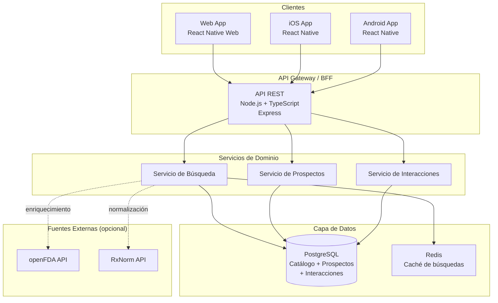

# Documento de Diseño Técnico: Consulta de Medicamentos (drug-medicine-lookup)

## Resumen de Investigación

Antes de escribir el diseño se investigaron las siguientes áreas:

- **APIs farmacéuticas públicas**: [openFDA](https://open.fda.gov/apis/) provee datos de medicamentos aprobados por la FDA (EE.UU.). [RxNorm / RxNav (NLM)](https://rxnav.nlm.nih.gov/RxNormAPIs.html) ofrece nomenclatura estandarizada de medicamentos y relaciones entre principios activos. La API de interacciones de RxNav fue discontinuada en enero 2024, por lo que las interacciones deben gestionarse con una base de datos propia o un proveedor alternativo (ej. DrugBank).
- **Búsqueda de texto completo**: PostgreSQL con extensión `pg_trgm` y GIN index soporta búsqueda fuzzy y autocompletado eficiente para catálogos de tamaño mediano (< 1M registros), sin necesidad de Elasticsearch.
- **Arquitectura cross-platform**: React Native con Expo permite compartir 60-80% del código entre iOS, Android y web (React Native Web), siendo la opción más madura para este tipo de aplicación.
- **Testing basado en propiedades**: [fast-check](https://fast-check.dev/) es la librería estándar para property-based testing en TypeScript/JavaScript, compatible con Vitest.

---

## Visión General

La aplicación **drug-medicine-lookup** es una plataforma móvil y web que permite a usuarios (pacientes, cuidadores y profesionales de la salud) consultar información farmacéutica de forma rápida y confiable. Las funcionalidades principales son: búsqueda por principio activo o nombre comercial, consulta de prospectos, verificación de interacciones medicamentosas, filtrado/ordenamiento de resultados e historial local de consultas.

### Decisiones de diseño clave

| Decisión | Elección | Justificación |
|---|---|---|
| Plataforma | React Native + Expo (con React Native Web) | Código compartido entre iOS, Android y web; ecosistema maduro |
| Backend | Node.js + TypeScript (API REST) | Consistencia de lenguaje con el frontend; tipado fuerte |
| Base de datos | PostgreSQL | Búsqueda full-text nativa con `pg_trgm`; sin infraestructura adicional |
| Búsqueda | PostgreSQL `pg_trgm` + GIN index | Suficiente para catálogos farmacéuticos; evita complejidad de Elasticsearch |
| Fuente de datos | Catálogo propio + integración con openFDA/RxNorm | Control sobre datos locales; enriquecimiento con fuentes públicas |
| Interacciones | Base de datos propia (importada de DrugBank o similar) | La API de interacciones de RxNav fue discontinuada en 2024 |
| Historial | AsyncStorage (local, por dispositivo) | Requisito explícito de almacenamiento local; sin sincronización en nube |
| Testing PBT | fast-check + Vitest | Estándar de la industria para TypeScript |

---

## Arquitectura

La aplicación sigue una arquitectura cliente-servidor con separación clara entre capas:



### Capas de la arquitectura

1. **Capa de presentación**: Aplicación React Native compartida entre iOS, Android y web. Gestión de estado con Zustand. Historial de consultas almacenado localmente con AsyncStorage.
2. **API REST (BFF)**: Servidor Node.js/Express que expone endpoints para búsqueda, prospectos e interacciones. Valida entradas, aplica paginación y normaliza respuestas.
3. **Servicios de dominio**: Lógica de negocio encapsulada en servicios independientes (búsqueda, prospectos, interacciones). Cada servicio es testeable de forma aislada.
4. **Capa de datos**: PostgreSQL como base de datos principal. Redis como caché para resultados de búsqueda frecuentes (TTL configurable).

---

## Componentes e Interfaces

### Frontend (React Native / Web)

#### Componentes principales

```
src/
├── screens/
│   ├── SearchScreen          # Pantalla principal de búsqueda
│   ├── ResultsScreen         # Lista de resultados con filtros
│   ├── ProspectScreen        # Detalle del prospecto
│   ├── InteractionsScreen    # Verificador de interacciones
│   └── HistoryScreen         # Historial de consultas
├── components/
│   ├── SearchBar             # Barra de búsqueda con autocompletado
│   ├── MedicineCard          # Tarjeta de resultado de medicamento
│   ├── ProspectSection       # Sección individual del prospecto
│   ├── InteractionBadge      # Badge de severidad de interacción
│   ├── FilterPanel           # Panel de filtros y ordenamiento
│   └── HistoryItem           # Ítem del historial
├── services/
│   ├── searchService         # Llamadas a la API de búsqueda
│   ├── prospectService       # Llamadas a la API de prospectos
│   ├── interactionService    # Llamadas a la API de interacciones
│   └── historyService        # Gestión del historial local (AsyncStorage)
├── store/
│   ├── searchStore           # Estado de búsqueda y resultados
│   ├── filterStore           # Estado de filtros activos
│   └── interactionStore      # Estado del verificador de interacciones
└── utils/
    ├── normalizeText         # Normalización de texto (tildes, mayúsculas)
    └── pagination            # Utilidades de paginación
```

#### Interfaces de servicio (frontend)

```typescript
// Servicio de búsqueda
interface SearchService {
  searchByActiveIngredient(query: string, page?: number): Promise<SearchResult>;
  searchByCommercialName(query: string, page?: number): Promise<SearchResult>;
  getSuggestions(query: string): Promise<string[]>;
}

// Servicio de historial local
interface HistoryService {
  addEntry(entry: HistoryEntry): Promise<void>;
  getEntries(): Promise<HistoryEntry[]>;
  removeEntry(id: string): Promise<void>;
  clearAll(): Promise<void>;
}

// Servicio de interacciones
interface InteractionService {
  checkInteractions(medicineIds: string[]): Promise<InteractionResult>;
}
```

### Backend (API REST)

#### Endpoints

| Método | Ruta | Descripción |
|---|---|---|
| `GET` | `/api/v1/medicines/search` | Búsqueda por principio activo o nombre comercial |
| `GET` | `/api/v1/medicines/suggestions` | Sugerencias de autocompletado (≥3 caracteres) |
| `GET` | `/api/v1/medicines/:id` | Detalle de un medicamento |
| `GET` | `/api/v1/medicines/:id/prospect` | Prospecto completo de un medicamento |
| `POST` | `/api/v1/interactions/check` | Verificar interacciones entre medicamentos |

#### Parámetros de búsqueda

```
GET /api/v1/medicines/search
  ?q=<término>           # Término de búsqueda (requerido, mín. 3 chars)
  &type=active|commercial # Tipo de búsqueda (default: active)
  &page=1                # Página (default: 1)
  &pageSize=20           # Tamaño de página (default: 20, máx: 20)
  &lab=<laboratorio>     # Filtro por laboratorio
  &form=<forma_farm>     # Filtro por forma farmacéutica
  &prescription=true|false # Filtro por condición de venta
  &sort=name_asc|name_desc # Ordenamiento
```

---

## Modelos de Datos

### Esquema de base de datos (PostgreSQL)

```sql
-- Principios activos
CREATE TABLE active_ingredients (
    id          UUID PRIMARY KEY DEFAULT gen_random_uuid(),
    name        TEXT NOT NULL,
    name_normalized TEXT NOT NULL,  -- sin tildes, minúsculas
    synonyms    TEXT[],
    created_at  TIMESTAMPTZ DEFAULT now()
);
CREATE INDEX idx_ai_name_trgm ON active_ingredients
    USING GIN (name_normalized gin_trgm_ops);

-- Medicamentos
CREATE TABLE medicines (
    id              UUID PRIMARY KEY DEFAULT gen_random_uuid(),
    commercial_name TEXT NOT NULL,
    commercial_name_normalized TEXT NOT NULL,
    laboratory      TEXT NOT NULL,
    pharmaceutical_form TEXT NOT NULL,  -- comprimido, jarabe, inyectable, etc.
    requires_prescription BOOLEAN NOT NULL DEFAULT true,
    presentations   JSONB,              -- [{dose, units, quantity}]
    created_at      TIMESTAMPTZ DEFAULT now(),
    updated_at      TIMESTAMPTZ DEFAULT now()
);
CREATE INDEX idx_med_name_trgm ON medicines
    USING GIN (commercial_name_normalized gin_trgm_ops);
CREATE INDEX idx_med_lab ON medicines (laboratory);
CREATE INDEX idx_med_form ON medicines (pharmaceutical_form);

-- Relación medicamento ↔ principios activos (N:M)
CREATE TABLE medicine_ingredients (
    medicine_id         UUID REFERENCES medicines(id) ON DELETE CASCADE,
    active_ingredient_id UUID REFERENCES active_ingredients(id) ON DELETE CASCADE,
    PRIMARY KEY (medicine_id, active_ingredient_id)
);

-- Prospectos
CREATE TABLE prospects (
    id                  UUID PRIMARY KEY DEFAULT gen_random_uuid(),
    medicine_id         UUID UNIQUE REFERENCES medicines(id) ON DELETE CASCADE,
    indications         TEXT,
    dosage              TEXT,
    contraindications   TEXT,
    warnings            TEXT,
    interactions_text   TEXT,
    adverse_effects     TEXT,
    overdose            TEXT,
    storage             TEXT,
    updated_at          TIMESTAMPTZ DEFAULT now()
);

-- Interacciones medicamentosas
CREATE TABLE drug_interactions (
    id              UUID PRIMARY KEY DEFAULT gen_random_uuid(),
    ingredient_a_id UUID REFERENCES active_ingredients(id),
    ingredient_b_id UUID REFERENCES active_ingredients(id),
    severity        TEXT NOT NULL CHECK (severity IN ('leve', 'moderada', 'grave')),
    description     TEXT NOT NULL,
    UNIQUE (ingredient_a_id, ingredient_b_id)
);
CREATE INDEX idx_interactions_a ON drug_interactions (ingredient_a_id);
CREATE INDEX idx_interactions_b ON drug_interactions (ingredient_b_id);
```

### Modelos TypeScript (compartidos frontend/backend)

```typescript
interface ActiveIngredient {
  id: string;
  name: string;
  synonyms: string[];
}

interface Medicine {
  id: string;
  commercialName: string;
  laboratory: string;
  pharmaceuticalForm: string;
  requiresPrescription: boolean;
  presentations: Presentation[];
  activeIngredients: ActiveIngredient[];
}

interface Presentation {
  dose: string;
  units: string;
  quantity: number;
}

interface Prospect {
  medicineId: string;
  indications: string;
  dosage: string;
  contraindications: string;
  warnings: string;
  interactionsText: string;
  adverseEffects: string;
  overdose: string;
  storage: string;
}

interface DrugInteraction {
  ingredientA: ActiveIngredient;
  ingredientB: ActiveIngredient;
  severity: 'leve' | 'moderada' | 'grave';
  description: string;
}

interface SearchResult {
  medicines: Medicine[];
  total: number;
  page: number;
  pageSize: number;
  totalPages: number;
}

interface InteractionResult {
  interactions: DrugInteraction[];
  hasInteractions: boolean;
  exceedsRecommendedLimit: boolean;  // true si > 5 medicamentos
}

interface HistoryEntry {
  id: string;
  query: string;
  type: 'active_ingredient' | 'commercial_name';
  timestamp: number;
}

type FilterState = {
  laboratory?: string;
  pharmaceuticalForm?: string;
  requiresPrescription?: boolean;
  sortOrder?: 'name_asc' | 'name_desc';
};
```

### Lógica de normalización de texto

La búsqueda insensible a mayúsculas y tildes se implementa en dos niveles:

1. **En base de datos**: columnas `*_normalized` almacenan el texto sin tildes y en minúsculas. Se actualizan mediante trigger en INSERT/UPDATE.
2. **En la API**: la función `normalizeText(input: string): string` aplica la misma transformación antes de construir la query.

```typescript
// utils/normalizeText.ts
export function normalizeText(text: string): string {
  return text
    .toLowerCase()
    .normalize('NFD')
    .replace(/[\u0300-\u036f]/g, '');  // elimina diacríticos
}
```

---

## Propiedades de Corrección

*Una propiedad es una característica o comportamiento que debe mantenerse verdadero en todas las ejecuciones válidas del sistema — esencialmente, una declaración formal sobre lo que el sistema debe hacer. Las propiedades sirven como puente entre las especificaciones legibles por humanos y las garantías de corrección verificables por máquinas.*

> **Reflexión de propiedades**: Se revisaron todas las propiedades identificadas en el prework para eliminar redundancias. Las propiedades 5.1 y 5.3 (filtros restrictivos con uno o múltiples filtros) se consolidaron en la Propiedad 4, ya que una implica a la otra. Las propiedades 4.1 y 4.2 (interacciones completas y con severidad válida) se consolidaron en la Propiedad 8, ya que ambas describen invariantes de la misma estructura de datos.

### Propiedad 1: Normalización de texto es idempotente

*Para cualquier* cadena de texto, aplicar la función de normalización dos veces consecutivas debe producir el mismo resultado que aplicarla una sola vez.

**Valida: Requisito 1.4**

---

### Propiedad 2: La búsqueda es insensible a mayúsculas y tildes

*Para cualquier* término de búsqueda válido, buscar el término original, su versión en mayúsculas y su versión sin tildes debe devolver el mismo conjunto de resultados.

**Valida: Requisito 1.4**

---

### Propiedad 3: La paginación cubre todos los resultados sin duplicados

*Para cualquier* búsqueda que devuelva N resultados, recorrer todas las páginas (con pageSize = 20) debe producir exactamente N medicamentos únicos en total, sin duplicados entre páginas, y ninguna página debe contener más de 20 elementos.

**Valida: Requisito 1.6**

---

### Propiedad 4: Los filtros son restrictivos y combinables

*Para cualquier* conjunto de resultados de búsqueda y cualquier combinación de filtros aplicados (laboratorio, forma farmacéutica, condición de venta), el conjunto filtrado debe ser un subconjunto del conjunto original donde todos los elementos cumplen simultáneamente todos los criterios de filtrado activos.

**Valida: Requisitos 5.1, 5.3**

---

### Propiedad 5: Eliminar todos los filtros restaura el resultado original

*Para cualquier* búsqueda con filtros aplicados, eliminar todos los filtros debe devolver exactamente el mismo conjunto de resultados que la búsqueda original sin filtros (propiedad de round-trip).

**Valida: Requisito 5.4**

---

### Propiedad 6: El historial mantiene orden cronológico inverso y respeta el límite de 20 entradas

*Para cualquier* secuencia de consultas realizadas (incluso más de 20), el historial almacenado localmente debe: (a) contener como máximo 20 entradas, descartando las más antiguas cuando se supera el límite, y (b) estar ordenado de la consulta más reciente a la más antigua.

**Valida: Requisitos 6.1, 6.2**

---

### Propiedad 7: Los resultados de búsqueda contienen la información requerida

*Para cualquier* resultado de búsqueda por nombre comercial, cada medicamento devuelto debe incluir: nombre comercial, al menos un principio activo, laboratorio fabricante y al menos una presentación disponible.

**Valida: Requisito 2.4**

---

### Propiedad 8: Las interacciones son simétricas y tienen severidad válida

*Para cualquier* par de principios activos A y B, si existe una interacción entre A y B, entonces: (a) también debe existir la misma interacción entre B y A con la misma severidad y descripción (simetría), y (b) el nivel de severidad debe ser exactamente uno de los valores válidos: 'leve', 'moderada' o 'grave'.

**Valida: Requisitos 4.1, 4.2**

---

### Propiedad 9: El prospecto contiene todas las secciones requeridas

*Para cualquier* prospecto devuelto por la API, la respuesta debe incluir todos los campos requeridos: indicaciones terapéuticas, posología, contraindicaciones, advertencias, interacciones, efectos adversos, sobredosis y condiciones de almacenamiento.

**Valida: Requisito 3.2**

---

## Manejo de Errores

### Estrategia general

Todos los errores se representan con una estructura uniforme en la API:

```typescript
interface ApiError {
  code: string;       // Código de error legible por máquina
  message: string;    // Mensaje descriptivo para el usuario
  details?: unknown;  // Información adicional (solo en desarrollo)
}
```

### Casos de error y respuestas

| Situación | Código HTTP | Código de error | Comportamiento en UI |
|---|---|---|---|
| Búsqueda sin resultados | 200 | — | Mensaje "No se encontraron medicamentos" (Req. 1.3, 2.3) |
| Término de búsqueda < 3 caracteres | 400 | `QUERY_TOO_SHORT` | Indicación visual en el buscador |
| Prospecto no disponible | 404 | `PROSPECT_NOT_FOUND` | Mensaje + sugerencia de consultar profesional (Req. 3.3) |
| Más de 5 medicamentos en interacciones | 200 | — | Aviso de análisis incompleto (Req. 4.4) |
| Sin conexión a internet | — | — | Mensaje de sin conexión (Req. 7.5) |
| Error interno del servidor | 500 | `INTERNAL_ERROR` | Mensaje genérico de error |
| Timeout de API externa | 503 | `UPSTREAM_TIMEOUT` | Mensaje de servicio temporalmente no disponible |

### Manejo de conectividad (cliente)

```typescript
// Detección de conectividad con NetInfo (React Native)
NetInfo.addEventListener(state => {
  if (!state.isConnected) {
    showOfflineMessage();
  }
});
```

### Límites de reintentos

- Las llamadas a la API tienen un timeout de 10 segundos.
- Se realizan hasta 2 reintentos automáticos con backoff exponencial para errores 5xx.
- Los errores 4xx no se reintentan.

---

## Estrategia de Testing

### Enfoque dual

Se combina testing basado en ejemplos con testing basado en propiedades:

- **Tests unitarios**: verifican comportamientos específicos, casos borde y condiciones de error.
- **Tests de propiedades**: verifican propiedades universales sobre rangos amplios de entradas usando [fast-check](https://fast-check.dev/) con Vitest.

### Herramientas

| Herramienta | Uso |
|---|---|
| **Vitest** | Runner de tests (unitarios y de propiedades) |
| **fast-check** | Property-based testing en TypeScript |
| **@testing-library/react-native** | Tests de componentes UI |
| **supertest** | Tests de integración de la API REST |
| **pg-mem** | Base de datos PostgreSQL en memoria para tests |

### Tests unitarios (ejemplos y casos borde)

- `normalizeText`: casos con tildes, mayúsculas, caracteres especiales, cadena vacía.
- `historyService`: agregar, eliminar, limpiar; verificar límite de 20 entradas.
- `filterMedicines`: filtros individuales y combinados; filtro que no coincide con ningún resultado.
- `buildSearchQuery`: construcción correcta de queries SQL con distintos parámetros.
- Componentes UI: renderizado de `MedicineCard`, `InteractionBadge` con distintos niveles de severidad.

### Tests de propiedades (fast-check)

Cada test de propiedad se ejecuta con un mínimo de **100 iteraciones**.

El formato de etiqueta para cada test es:
`Feature: drug-medicine-lookup, Propiedad {N}: {texto de la propiedad}`

```typescript
// Ejemplo de test de propiedad para Propiedad 1
import { describe, it } from 'vitest';
import fc from 'fast-check';
import { normalizeText } from '../utils/normalizeText';

describe('Propiedad 1: Normalización idempotente', () => {
  it('normalizeText(x) === normalizeText(normalizeText(x)) para cualquier string', () => {
    // Feature: drug-medicine-lookup, Propiedad 1: Normalización de texto es idempotente
    fc.assert(
      fc.property(fc.string(), (text) => {
        const once = normalizeText(text);
        const twice = normalizeText(once);
        return once === twice;
      }),
      { numRuns: 100 }
    );
  });
});
```

### Tests de integración

- Endpoints de búsqueda con base de datos real (PostgreSQL en contenedor Docker).
- Verificación de paginación con catálogos de distintos tamaños.
- Verificación de interacciones con pares de principios activos conocidos.

### Tests de accesibilidad

- Verificación de roles ARIA en componentes web.
- Tests de contraste de color con herramientas automatizadas (axe-core).
- Nota: la validación completa de WCAG 2.1 AA requiere revisión manual con tecnologías asistivas.

### Cobertura objetivo

| Capa | Cobertura mínima |
|---|---|
| Utilidades (normalización, paginación) | 95% |
| Servicios de dominio (backend) | 85% |
| Componentes UI | 70% |
| Integración API | Casos principales + errores |
